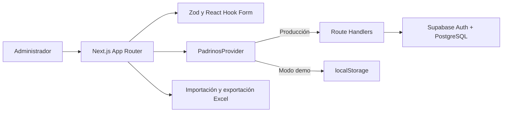

<p align="center">
  
</p>

# Panel administrativo de padrinos

Aplicación interna para administrar el padrón de padrinos de **Fundación Juntos por los Demás A.C.** Incluye captura y actualización de registros, importación masiva, seguimiento, reportes operativos y exportación a Excel.

Este documento está dirigido principalmente a la persona que mantenga o extienda el sistema.

## Estado técnico

| Componente | Implementación |
| --- | --- |
| Framework | Next.js 16, App Router y React 19 |
| Lenguaje | TypeScript en modo estricto |
| Persistencia | PostgreSQL mediante Supabase |
| Autenticación | Supabase Auth con sesiones por cookies |
| Validación | Zod en cliente y servidor |
| Archivos | SheetJS para Excel y CSV |
| Pruebas | Vitest y Playwright |
| Despliegue previsto | Vercel + Supabase |

## Alcance funcional

La aplicación permite:

- Registrar padrinos como persona física o empresa.
- Editar datos de identidad, contacto, domicilio y patrocinio.
- Detectar posibles duplicados mediante RFC o correo normalizados.
- Buscar, filtrar, ordenar y paginar el padrón.
- Cambiar registros entre `pendiente`, `activo` e `inactivo`.
- Importar hasta 5,000 registros desde `.xlsx` o `.csv`.
- Descargar incidencias de una importación parcial.
- Consultar exactamente tres reportes:
  1. Padrón y estatus.
  2. Aportaciones comprometidas.
  3. Altas y captación.
- Exportar cada reporte a un libro de Excel con hojas `Resumen` y `Detalle`.

Fuera de alcance:

- Procesamiento o conciliación de pagos reales.
- Contabilidad y facturación.
- Expedientes clínicos o información de pacientes.
- Sincronización automática con el sistema anterior de Oracle.

## Arquitectura



La aplicación tiene dos modos de ejecución deliberadamente compatibles:

### Producción

Cuando existen las variables de Supabase y `NEXT_PUBLIC_DEMO_MODE=false`, el frontend consume los Route Handlers de Next.js. Cada endpoint vuelve a validar la sesión y el payload antes de acceder a PostgreSQL. Las políticas RLS constituyen la última capa de autorización.

### Demostración

Cuando faltan las credenciales o `NEXT_PUBLIC_DEMO_MODE=true`, `PadrinosProvider` utiliza datos ficticios y `localStorage`. Este modo permite evaluar toda la interfaz sin infraestructura externa.

El modo demo no debe utilizarse con información personal real ni considerarse persistencia confiable.

## Estructura del repositorio

```text
src/
├── app/
│   ├── (app)/                 Rutas privadas y layout administrativo
│   │   ├── padrinos/          Listado, alta y edición
│   │   ├── importar/          Carga y previsualización de archivos
│   │   └── reportes/          Los tres reportes operativos
│   ├── (auth)/                Login y recuperación de contraseña
│   ├── api/                   Endpoints validados de padrinos e importación
│   └── auth/callback/         Intercambio de código de Supabase Auth
├── components/
│   ├── padrinos-provider.tsx  Abstracción demo/producción y estado compartido
│   ├── padrino-form.tsx       Formulario principal
│   └── charts.tsx             Visualizaciones sin dependencia gráfica externa
└── lib/
    ├── padrinos.ts            Esquema, tipos, normalización y cálculos
    ├── spreadsheet.ts         Lectura, plantilla y exportaciones
    ├── constants.ts           Catálogos y estados
    └── supabase/              Clientes de navegador, servidor y sesión

supabase/
├── migrations/               Esquema, índices, RLS y auditoría
└── seed.sql                   Datos ficticios opcionales

e2e/                           Pruebas Playwright de escritorio y móvil
proxy.ts                       Protección y renovación de sesiones en Next.js 16
```

## Modelo de dominio

El contrato principal está definido en `src/lib/padrinos.ts`. `PadrinoInput` representa el payload editable y `Padrino` agrega identificadores y metadatos de auditoría.

Grupos de campos:

- Identidad: `tipo`, nombres, apellidos, razón social, RFC y contacto responsable.
- Contacto: correo, teléfonos y canal preferido.
- Domicilio: país, estado, municipio, código postal y dirección.
- Patrocinio: fecha de alta, aportación, periodicidad, método, origen y seguimiento.
- Control: estatus, fechas de creación/actualización y usuarios responsables.

Catálogos persistidos como valores estables:

```text
tipo:             persona | empresa
estatus:          pendiente | activo | inactivo
canal:            whatsapp | llamada | correo
periodicidad:     unica | mensual | trimestral | semestral | anual
metodo_pago:      transferencia | tarjeta | efectivo | deposito | otro
origen:           recomendacion | redes | evento | empresa | sitio_web | otro
```

No cambies estos valores directamente para modificar una etiqueta visual. Las etiquetas en español viven en `src/lib/constants.ts`; cambiar un valor persistido requiere una migración de datos.

## Invariantes importantes

Estas reglas forman parte del comportamiento esperado y deben conservarse:

1. No existe eliminación física de padrinos. Una baja cambia `estatus` a `inactivo`.
2. No existe registro público de administradores. Las cuentas se invitan desde Supabase.
3. La clave `service_role` nunca debe llegar al navegador ni guardarse en este repositorio.
4. Los payloads se validan en cliente, API y base de datos.
5. Correo, RFC y teléfonos se normalizan antes de persistirse.
6. Correo y RFC se utilizan para prevenir duplicados; el RFC solo es único cuando tiene valor.
7. Una fecha de seguimiento vacía se convierte a `NULL` antes de llegar a PostgreSQL.
8. El historial se conserva mediante `created_at`, `updated_at`, `created_by`, `updated_by` y `auditoria`.
9. Los estados se comunican con texto, símbolo y color; nunca únicamente con color.
10. Las aportaciones representan compromisos declarados, no transacciones confirmadas.

### Equivalente mensual

El reporte de aportaciones utiliza estos factores:

| Periodicidad | Cálculo mensual |
| --- | ---: |
| Única | `0` |
| Mensual | `aportacion` |
| Trimestral | `aportacion / 3` |
| Semestral | `aportacion / 6` |
| Anual | `aportacion / 12` |

La función fuente es `monthlyEquivalent` en `src/lib/padrinos.ts`. Una aportación única se reporta por separado y no se prorratea.

## Rutas y responsabilidades

| Ruta | Responsabilidad |
| --- | --- |
| `/login` | Inicio de sesión o acceso al modo demo. |
| `/recuperar` | Solicitud de recuperación de contraseña. |
| `/restablecer` | Definición de contraseña nueva. |
| `/` | Indicadores y seguimientos próximos. |
| `/padrinos` | Consulta, filtros, paginación y cambio de estado. |
| `/padrinos/nuevo` | Alta de padrino. |
| `/padrinos/[id]` | Consulta y edición. |
| `/importar` | Plantilla, previsualización y carga masiva. |
| `/reportes` | Reportes filtrables y exportación. |
| `/api/padrinos` | Consulta y alta validadas. |
| `/api/padrinos/[id]` | Actualización validada. |
| `/api/importar` | Importación parcial y registro de incidencias. |
| `/auth/callback` | Finalización del flujo PKCE de Supabase. |

`proxy.ts` protege las páginas privadas. Los endpoints no redirigen cuando falta una sesión: responden con error de autorización para evitar que el frontend intente interpretar HTML como JSON.

## Instalación local

Requisitos:

- Node.js 20 o superior.
- npm.

```bash
npm install
copy .env.example .env.local
npm run dev
```

La aplicación estará disponible en `http://localhost:3000`.

El archivo `.env.example` activa el modo demostración. No contiene secretos.

## Configuración de Supabase

1. Crear un proyecto de Supabase.
2. Ejecutar `supabase/migrations/202609010001_initial_schema.sql` mediante Supabase CLI o SQL Editor.
3. Ejecutar opcionalmente `supabase/seed.sql` para insertar registros ficticios.
4. Crear o invitar administradores desde **Authentication → Users**.
5. Configurar `.env.local`:

```env
NEXT_PUBLIC_SUPABASE_URL=https://TU-PROYECTO.supabase.co
NEXT_PUBLIC_SUPABASE_ANON_KEY=TU_CLAVE_ANON
NEXT_PUBLIC_DEMO_MODE=false
```

6. Registrar las URLs permitidas en **Authentication → URL Configuration**:

```text
http://localhost:3000/auth/callback
https://TU-DOMINIO/auth/callback
```

La migración inicial crea:

- `padrinos`: registro operativo principal.
- `importaciones`: resultado y estadísticas de cargas masivas.
- `auditoria`: cambios realizados sobre padrinos.
- Índices únicos y de consulta.
- Restricciones de dominio.
- Políticas RLS para usuarios autenticados.
- Trigger de actualización y auditoría.

No existe una política RLS de `DELETE` para padrinos.

## Importación y exportación

### Importación

`src/lib/spreadsheet.ts` concentra el contrato tabular:

- `IMPORT_COLUMNS` define las columnas de la plantilla.
- `parseSpreadsheet` normaliza encabezados, opciones y fechas.
- `downloadTemplate` genera la plantilla de referencia.
- `downloadIssues` genera el archivo de errores.

Límites actuales:

- `.xlsx` y `.csv`.
- 10 MB por archivo.
- 5,000 filas por operación.
- Fechas `AAAA-MM-DD` o `DD/MM/AAAA`.
- Inserción parcial: las filas válidas se conservan y las inválidas se reportan.

### Exportación

`exportReport` crea dos hojas:

- `Resumen`: indicadores calculados del reporte activo.
- `Detalle`: registros que cumplen los filtros actuales.

Los valores de texto se protegen contra formula injection antes de escribirse en Excel.

SheetJS se instala desde su distribución oficial corregida (`xlsx-0.20.3.tgz`), no desde la versión obsoleta disponible en npm. Conserva este origen al actualizar dependencias o valida nuevamente con `npm audit`.

## Cómo agregar o modificar un campo

Un cambio de campo no termina en el formulario. Actualiza el contrato completo en este orden:

1. Crear una nueva migración SQL; no modificar una migración ya aplicada en producción.
2. Agregar la columna y sus restricciones en PostgreSQL.
3. Actualizar `padrinoSchema`, `PadrinoInput` y `padrinoDefaults`.
4. Agregar normalización en `normalizePadrino` si corresponde.
5. Actualizar el formulario y sus mensajes de validación.
6. Incluir el campo en `IMPORT_COLUMNS` y en el mapeo de Excel cuando sea importable.
7. Incluirlo en `detailRows` si debe aparecer en exportaciones.
8. Actualizar datos demo y `supabase/seed.sql`.
9. Agregar casos unitarios y E2E.
10. Ejecutar la lista completa de calidad antes de desplegar.

Para modificar únicamente un texto visible de un catálogo, cambia `src/lib/constants.ts`; no requiere migración mientras el `value` permanezca igual.

## Flujo de desarrollo

```bash
# servidor local
npm run dev

# validaciones rápidas
npm run typecheck
npm run lint
npm test

# validación de producción
npm run build

# recorridos completos
npm run test:e2e
```

Playwright necesita Chromium la primera vez:

```bash
npx playwright install chromium
```

Cobertura mínima esperada al modificar el dominio:

- Validaciones condicionales para persona y empresa.
- Normalización y duplicados.
- Cálculo del equivalente mensual.
- Lectura de encabezados y fechas de Excel.
- Alta y edición en escritorio y móvil.
- Navegación entre los tres reportes.

## Despliegue

El destino previsto es Vercel:

1. Importar el repositorio.
2. Registrar las variables de Supabase para Preview y Production.
3. Ejecutar primero las migraciones de base de datos.
4. Desplegar la aplicación.
5. Registrar el callback final en Supabase Auth.
6. Crear las cuentas administrativas.
7. Validar con datos ficticios.
8. Importar información real únicamente después de autorizar el acceso y el tratamiento de datos.

### Checklist de entrega

- [ ] `npm run typecheck`
- [ ] `npm run lint`
- [ ] `npm test`
- [ ] `npm run build`
- [ ] `npm run test:e2e`
- [ ] `npm audit` sin vulnerabilidades conocidas
- [ ] Migraciones aplicadas antes del frontend
- [ ] Callback de autenticación registrado
- [ ] RLS comprobado con usuario autenticado y anónimo
- [ ] Exportación revisada con filtros activos
- [ ] Respaldo realizado antes de una importación real

## Consideraciones operativas

- El modo demo guarda datos por navegador; limpiar almacenamiento elimina esos cambios.
- La importación evita que una fila inválida cancele todo el archivo.
- Una importación grande se procesa actualmente en una sola petición. Si el volumen supera 5,000 filas, conviene migrar a procesamiento por lotes o una tarea en segundo plano.
- Los catálogos están definidos en código. Si necesitan administración dinámica, deben convertirse en tablas con una migración explícita.
- El sistema no tiene todavía una interfaz para administrar usuarios; esa operación se realiza en Supabase.
- Antes de almacenar información real debe existir una política institucional de privacidad, acceso, respaldo y retención.

## Diagnóstico rápido

| Problema | Revisión recomendada |
| --- | --- |
| La aplicación abre en modo demo | Verificar las tres variables de entorno y volver a compilar. |
| El login funciona pero no hay datos | Confirmar que la migración se aplicó y revisar las políticas RLS. |
| La recuperación vuelve a login | Revisar las Redirect URLs y `/auth/callback`. |
| Una fecha vacía falla en PostgreSQL | Confirmar el uso de `toDatabasePadrino`. |
| El Excel rechaza opciones válidas | Revisar `normalizedOption` y los valores estables de `constants.ts`. |
| Playwright no encuentra Chromium | Ejecutar `npx playwright install chromium`. |
| El puerto 3000 está ocupado | Cerrar el servidor anterior o iniciar Next.js en otro puerto. |

## Principio de mantenimiento

Prioriza cambios pequeños y trazables: migración aditiva, validación compartida, prueba automatizada y despliegue después de verificar RLS. La información de padrinos es información personal; cualquier nueva función debe conservar el acceso mínimo necesario y evitar exposiciones en logs, URLs o archivos públicos.
